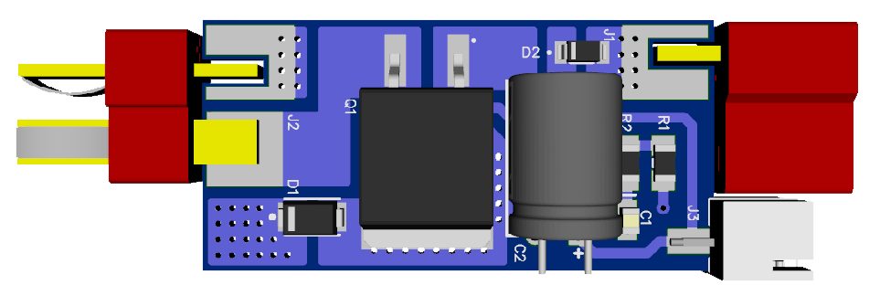
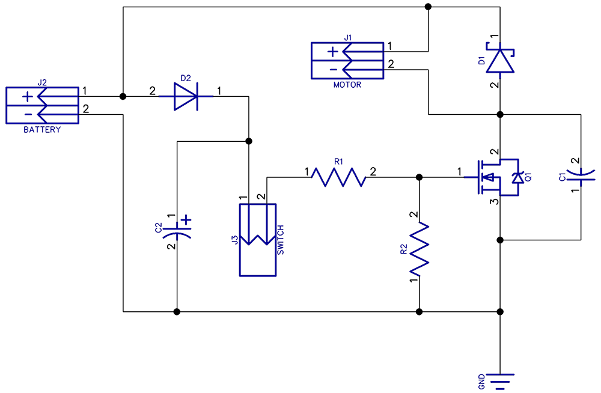

# AirHEX
AirHEX - open hardware HEXFET® Power MOSFET based airsoft motor driver, designed in DipTrace CAD.

## Schematic

## BOM

* **Q1** - IRF2804SPbF@IR
* **C1** - CC0805ZRY5V9BB105@YAGEO or any Ceramic cap, surface mount, package = 0805, capacity = 1uF, voltage >= 50V
* **C2** - SK025M0220B3F-0811@YAGEO or any Electrolytic cap, through hole, size <= 8x11mm, capacity >= 220uF, voltage => 25V
* **D1** - SS14@VISHAY, or any Schottky diode, surface mount, package = SMA (DO-214AC), voltage => 40V, current = 1A
* **D2** - MMSD4148@ONS, or any Switching diode, surface mount, package = SOD-123, voltage = 100V, current = 200mA
* **R1** - RC1206JR-07100RL@YAGEO or any Resistor, surface mount, package = 1206, resistance = 100R
* **R2** - RC1206JR-0730KL@YAGEO or any Resistor, surface mount, package = 1206, resistance = 30K
* **J1** - T-Deans Female Connector
* **J2** - T-Deans Male Connector
* **J3** - CWF-2 MV-A / DS1069-2 M Connector